# Opaque Chat
Opaque Chat is a purely client-side Fabric mod that brings end-to-end encryption to Minecraft chat. Communicate securely with your friends on any server without the server owner, console, or other players understanding a single word out of your chat.

## Features

    End-to-End Encryption: Your messages are secured using ECDH (secp256r1) encryption for secure key exchange and AES-GCM for symmetric message encryption.

    Seamless GUI Integration: Opaque Chat has a sleek, animated slide-out panel in the vanilla Chat screen.

    Highly Configurable: Using Yet Another Config Lib (YACL) for the config GUI. (more config options should be possible if requested)

    Client-Side Only: Opaque Chat works on any server as long as the server allows standard chat messages to be sent and received.

## How It Works

Opaque Chat intercepts incoming and outgoing chat messages prefixed with !oc_.
When you invite a player, the mod performs a silent cryptographic handshake (!oc_req and !oc_key) to exchange public keys over the server's public chat. Once a shared secret is established, your messages are encrypted (!oc_msg) before they ever leave your client. Server logs will only see base64-encoded strings, while you and your friend see clean, formatted text.

## Dependencies

    Fabric Loader & Fabric API

    Yet Another Config Lib

    ModMenu (Optional, but recommended)

## Usage
Opening the Interface

    Open your standard Minecraft chat (T by default).

    Click the "OC" button in the bottom right corner of the screen to access the Opaque Chat interface.

Starting a Secure Chat

    Send an Invite: Use the GUI action buttons or use /oc invite <player> in chat.

    Accept an Invite: The receiving player will get a notification. They can click [ACCEPT] in chat, use the GUI "Requests" tab, or use /oc accept <player>.

Sending Messages

Once a secure link is established:

    Select the contact in the Opaque Chat GUI panel and type your message into the "Secure Message" field.

    Alternatively, use the command /oc msg <player> <message>.

## Commands

    /oc help - Shows the available commands menu.

    /oc invite <target> - Start a secure chat handshake with another player.

    /oc accept <target> - Accept an incoming secure chat request.

    /oc msg <target> <message> - Send an encrypted message manually.

    /oc config - Open the YACL configuration screen.

    /oc reload - Reload the opaque_chat configuration files from disk.

## Example of how it work
Normal GUI (before/after expanding the mod's GUI)
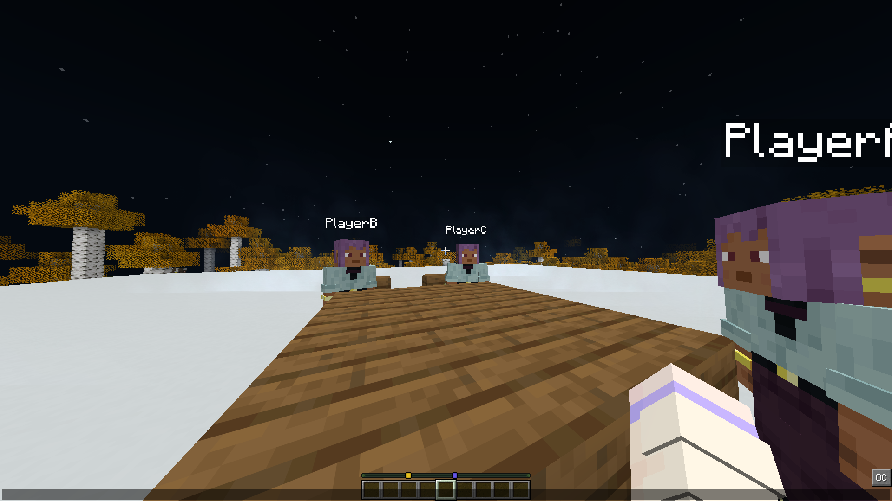
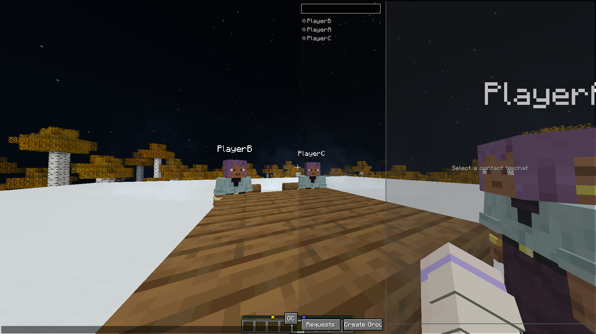

When you click on a player you have not made a contact yet
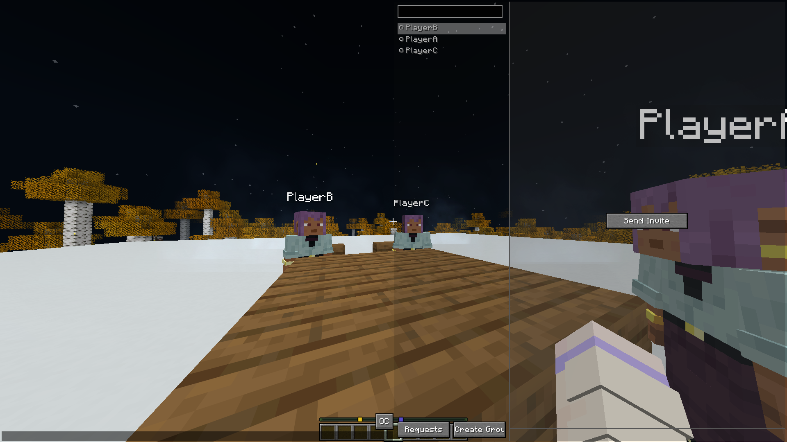

After sending an "invite", you will get this notice
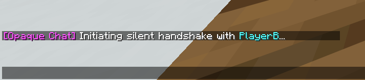

While the other player will see
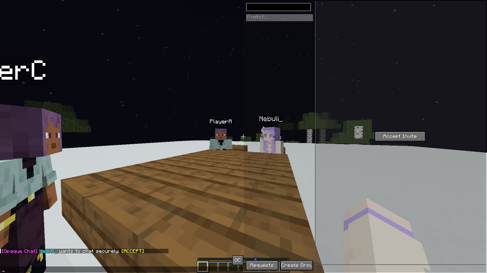
If another player happen to have the mod but is not invited
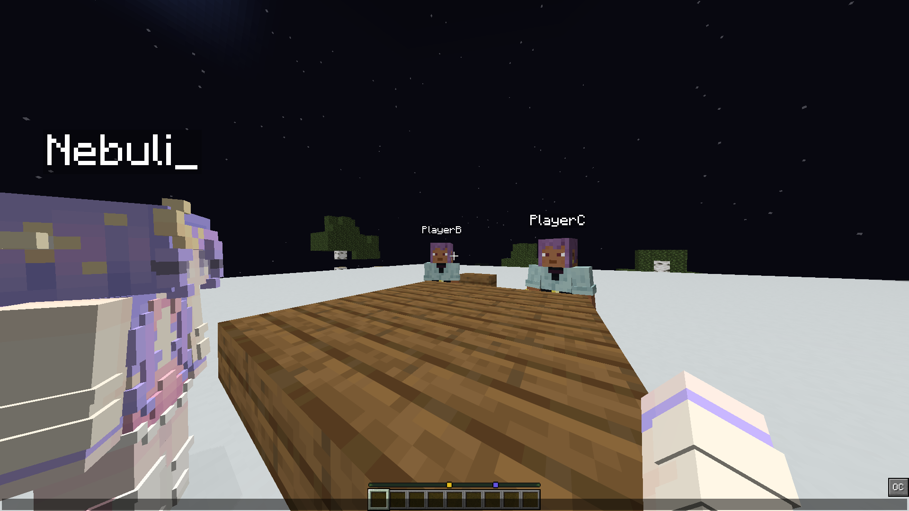
And normal players will see this
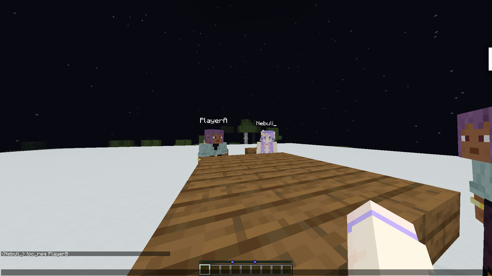

When the invited player accept invitation
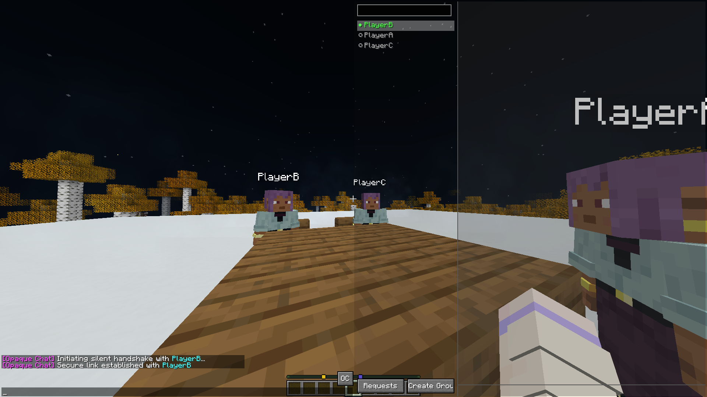
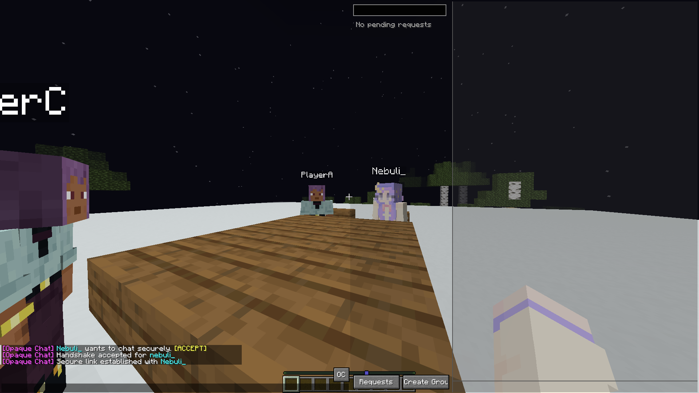
Players with the mod installed wouldn't see anything while normal player will see 3 chunks of code
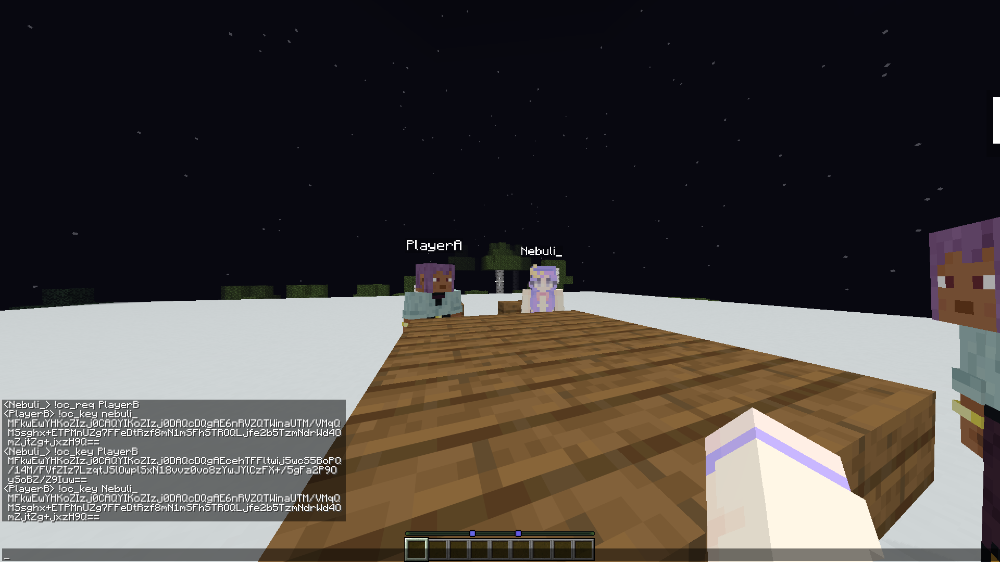

After having a connection, the conversation can be carried out on the right panel
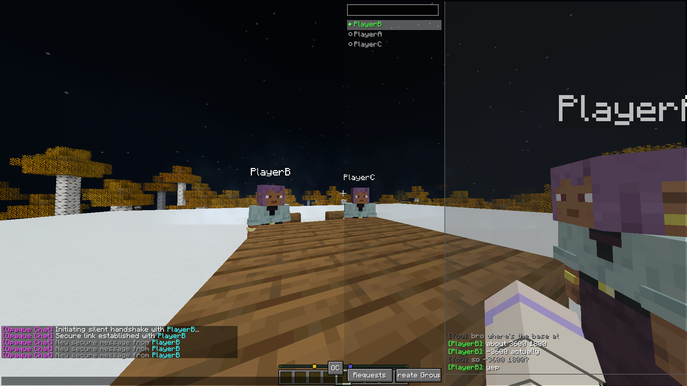
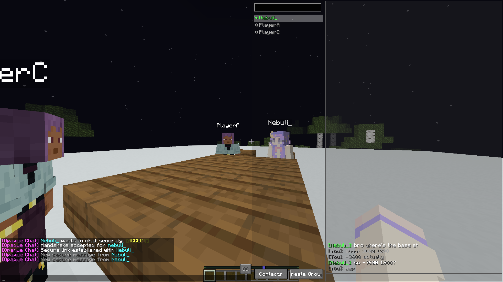
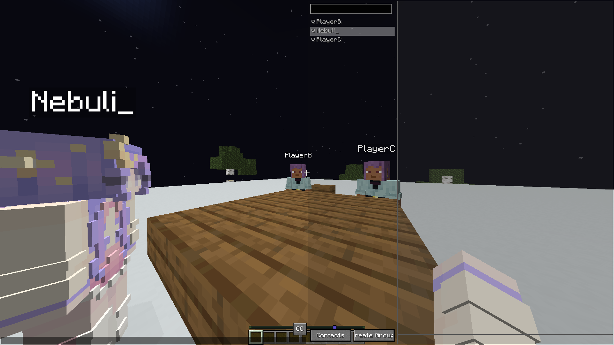
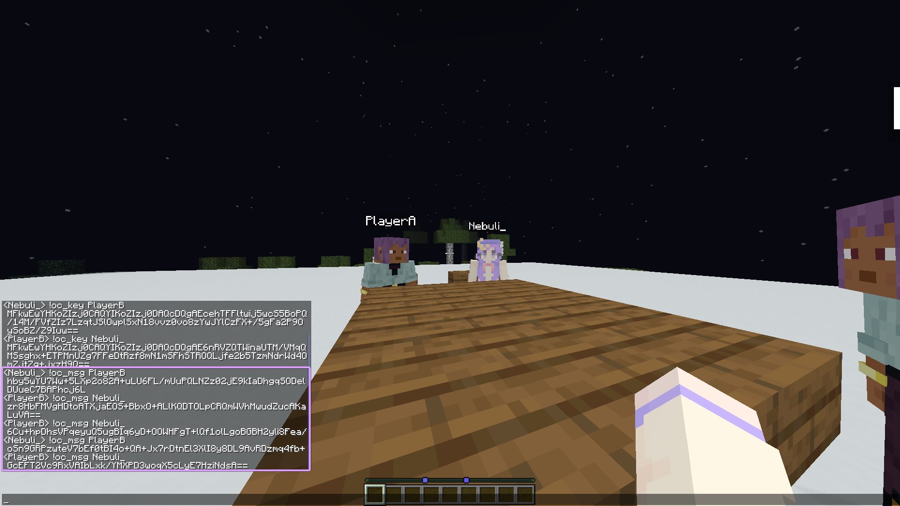

Each key will be saved in the config folder and will be reused even after restarting the game. So each player only have to invite the other player once.
I am currently working on a compression library and group chat functionality, which will be updated soon.
